# Palette — Typora Theme Collection

A curated collection of 12 distinctive Typora themes, designed for writing requirement documents and task tracking. Each theme features carefully chosen typography with [Space Grotesk](https://fonts.google.com/specimen/Space+Grotesk) as the signature geometric sans-serif, paired with complementary fonts for optimal readability.

## Themes

| Theme | Preview | Type | Description |
|-------|---------|------|-------------|
| **Aurora** | 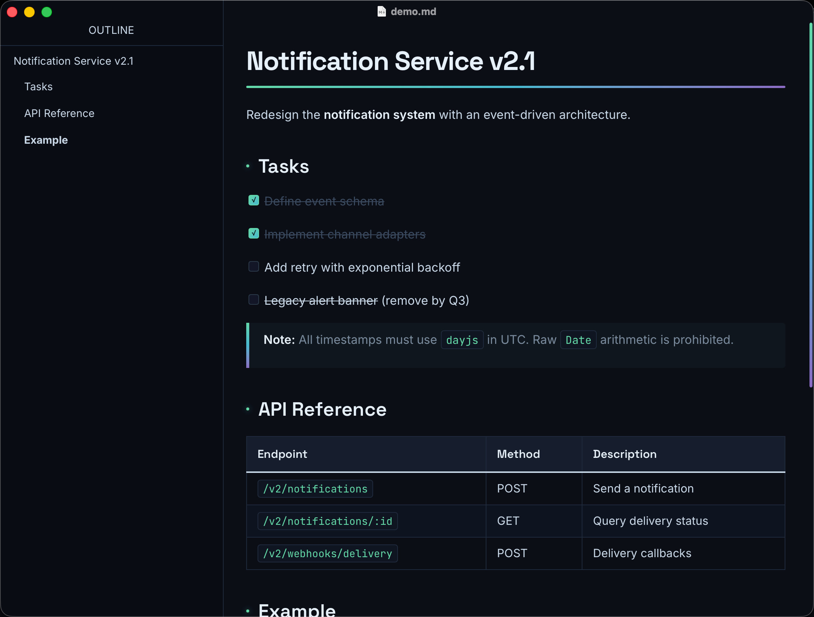 | Dark | Northern Lights — green-to-cyan-to-purple gradients on polar night black. Gradient H1 underline, blockquote borders, HR. |
| **Brutalist** | 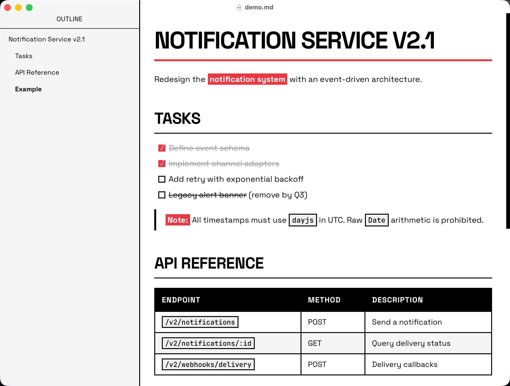 | Light | Raw Bauhaus-inspired. 3em uppercase H1, thick black borders, zero border-radius. Bold text as white-on-red. |
| **Carbon** | 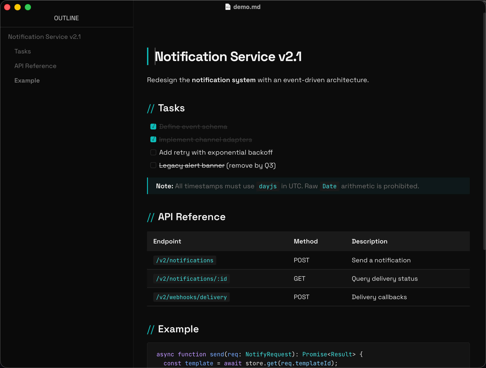 | Dark | Near-black monochrome with surgical teal accents. H2 prefixed with `//`. Horizontal-only table borders. |
| **Contrast** | 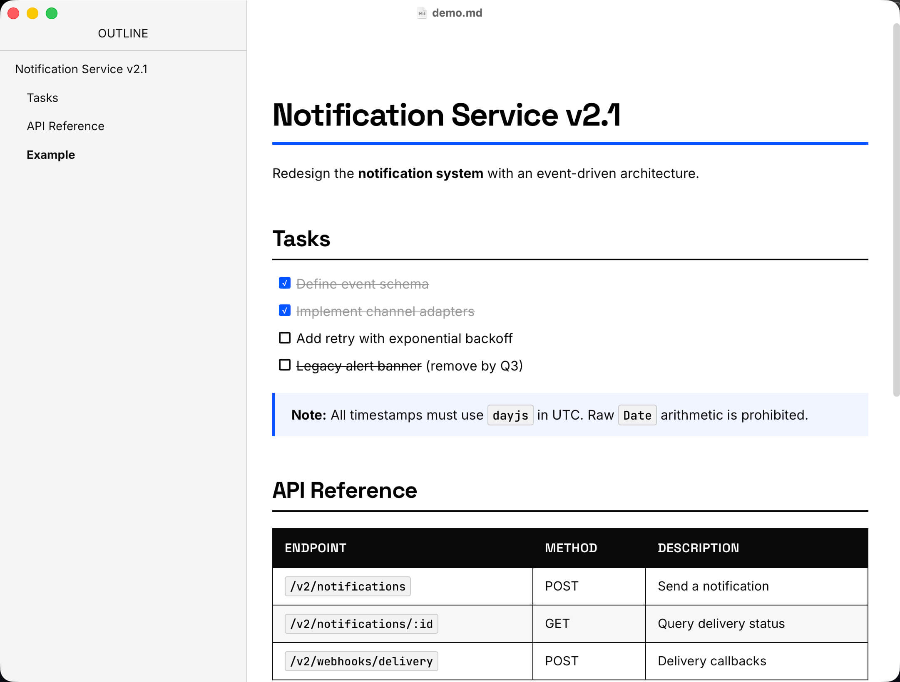 | Light | Maximum contrast — pure black on white with electric blue accents. Black table headers, bold borders. |
| **Glacier** | 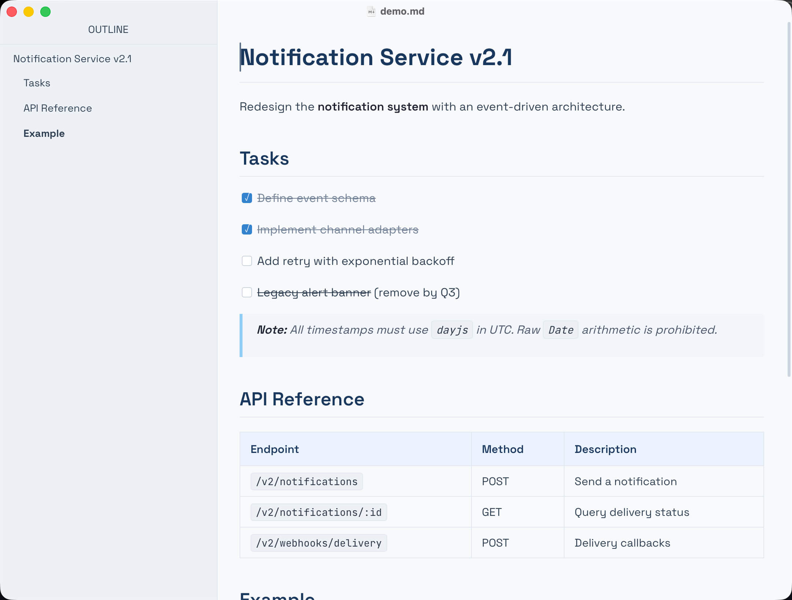 | Light | Cool icy blue-white with clean geometric lines. Space Grotesk throughout. Calm, focused, technical. |
| **Graphite** | 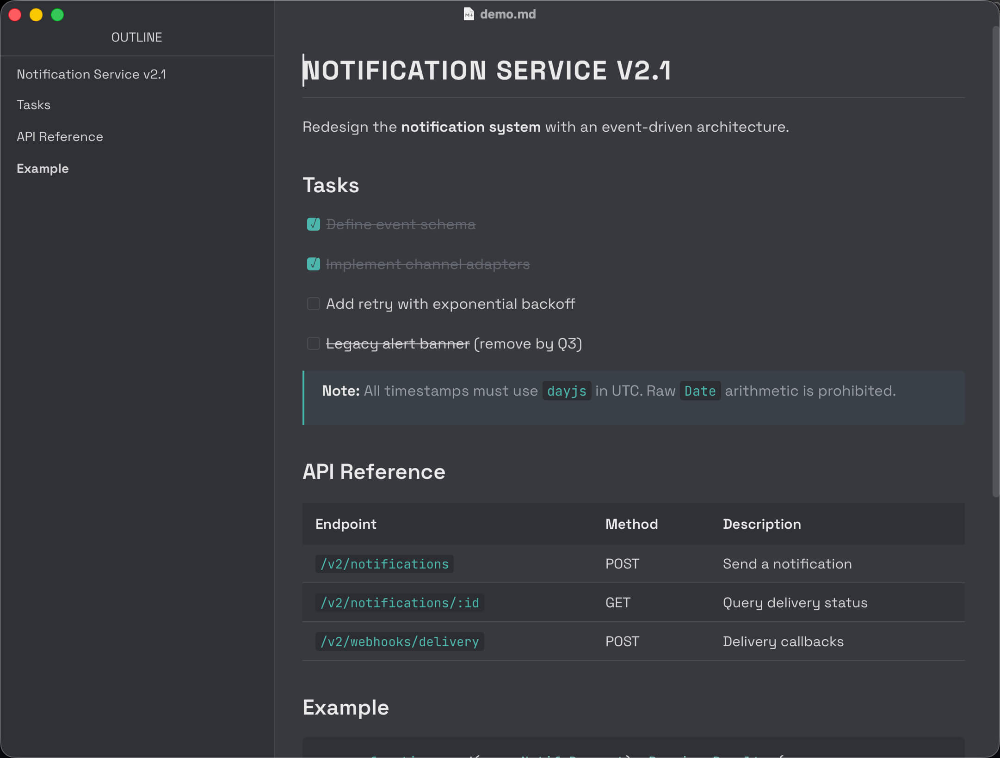 | Dark | Unique mid-tone gray with emerald teal accents. Uppercase H1, teal-bordered H3. Reduced contrast for extended sessions. |
| **Horizon** | 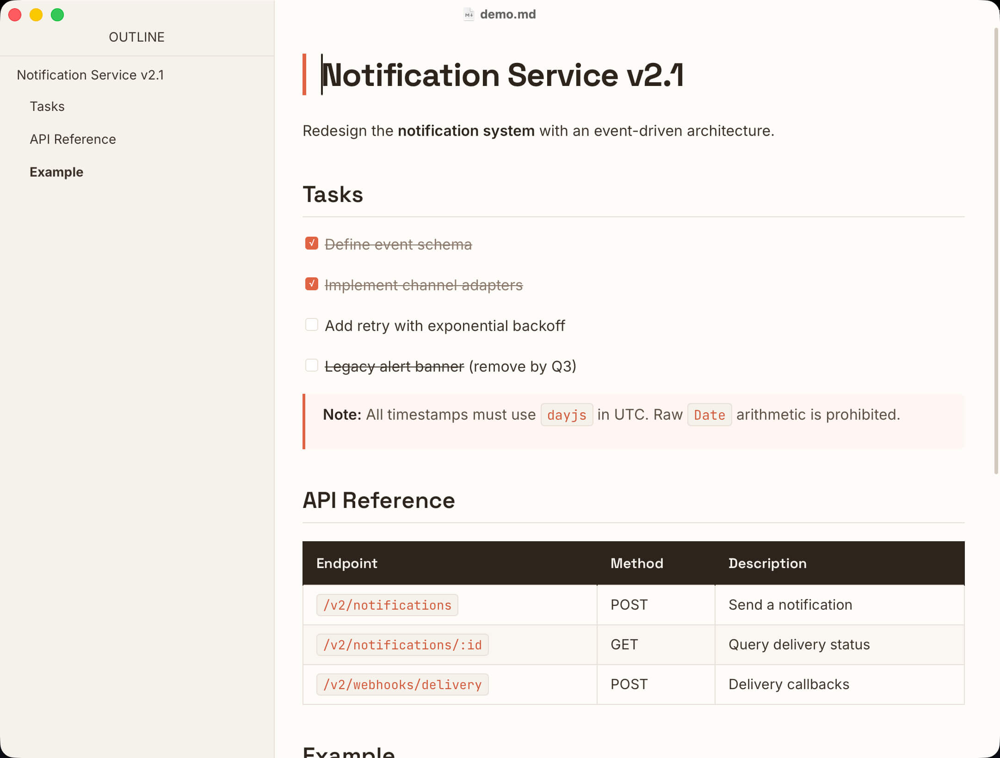 | Light | Warm coral and terracotta accents on cream. H1 with distinctive left coral border. Energetic yet professional. |
| **Ink** | 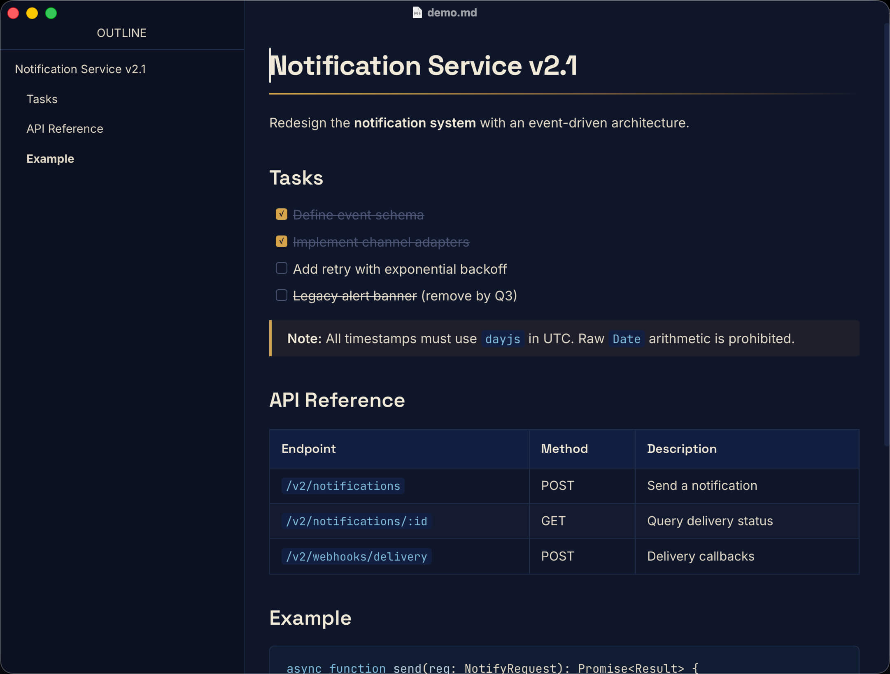 | Dark | Deep midnight navy with warm cream text and ink-gold accents. Literary and warm. Gold gradient H1 underline. |
| **Nordic** | 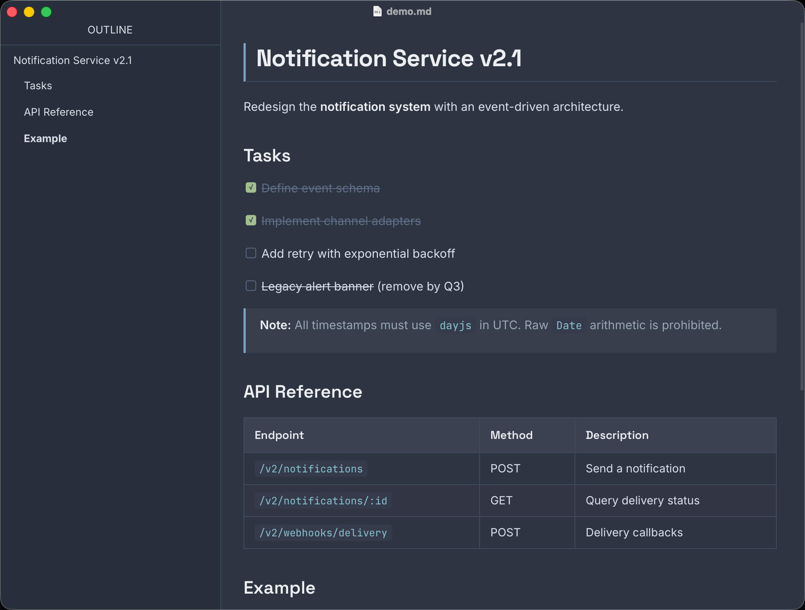 | Dark | Nord color palette — muted polar night blues with frost and aurora accent colors. Green checkboxes. |
| **Onyx** | 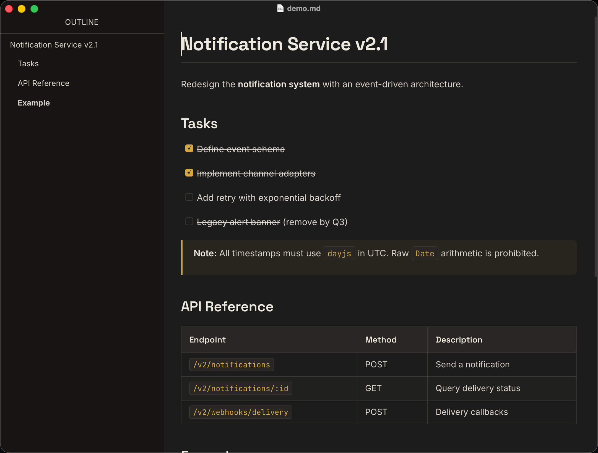 | Dark | Warm charcoal with restrained gold accents. Editorial luxury. Like a high-end magazine's dark mode. |
| **Sandstone** | 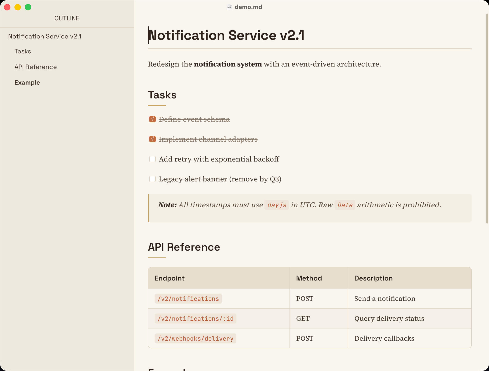 | Light | Desert-inspired warm earth tones. Source Serif 4 body for a book-like reading experience. |
| **Zenith** | 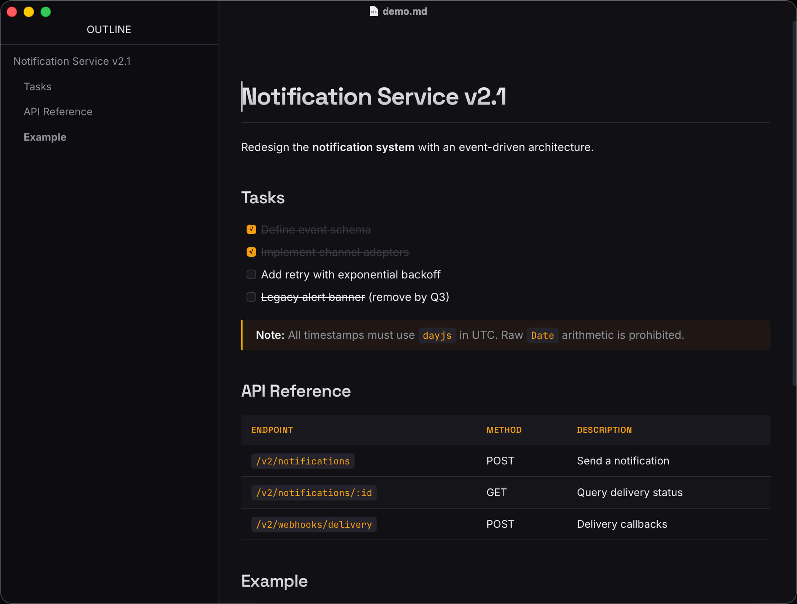 | Dark | Premium SaaS-inspired layered dark surfaces with amber accents. Gradient text headings, glowing code blocks. |

## Typography

Each theme uses carefully selected font pairings bundled as local `.woff2` files for offline use:

| Font | Role | Themes |
|------|------|--------|
| [Space Grotesk](https://fonts.google.com/specimen/Space+Grotesk) | Headings / Body | Glacier, Carbon, Graphite, Brutalist (all text) |
| [Inter](https://fonts.google.com/specimen/Inter) | Body text | Onyx, Horizon, Nordic, Ink, Aurora, Zenith, Contrast |
| [Source Serif 4](https://fonts.google.com/specimen/Source+Serif+4) | Body text (serif) | Sandstone |
| [IBM Plex Sans](https://fonts.google.com/specimen/IBM+Plex+Sans) | Body text | — |
| [JetBrains Mono](https://fonts.google.com/specimen/JetBrains+Mono) | Code blocks | All themes |
| [IBM Plex Mono](https://fonts.google.com/specimen/IBM+Plex+Mono) | Code blocks | — |

## Installation

1. Open Typora → **Preferences** → **Appearance** → **Open Theme Folder**
2. Copy the desired `.css` files and the entire `fonts/` folder into the theme folder
3. Restart Typora
4. Select your theme from **Themes** menu

```
Typora Theme Folder/
├── glacier.css
├── aurora.css
├── ...
└── fonts/
    ├── space-grotesk/
    ├── inter/
    ├── jetbrains-mono/
    ├── source-serif/
    ├── ibm-plex-sans/
    └── ibm-plex-mono/
```

## Designed For

These themes are optimized for writing **requirement documents** and **TODO tracking**:

- Clear heading hierarchy for document structure
- Styled task list checkboxes with theme-appropriate accent colors
- Clean, readable tables for data and specifications
- Well-differentiated code blocks for technical content
- Distinctive blockquotes for notes and callouts
- Print-ready styles via `@media print`

## Compatibility

Designed and tested on **macOS**. Should work on Windows and Linux, but not fully tested on those platforms.

## License

[MIT](LICENSE)
